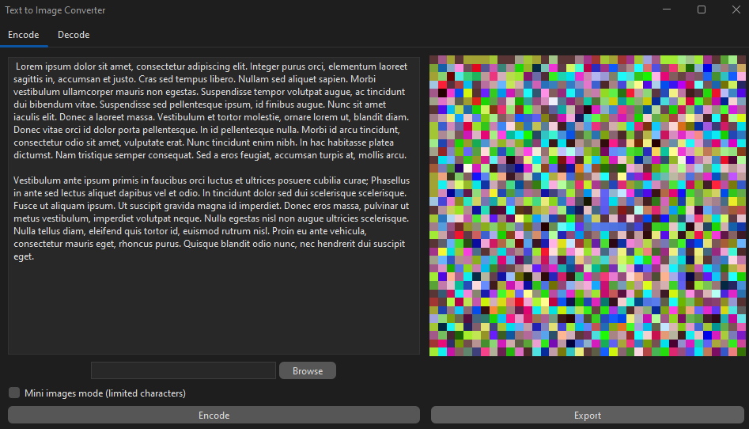

# Text to Image Converter

This application allows you to convert any text into an image using a unique encoding method. It also allows you to decode any image created by this application back into the original text.

## Features

- **Text to Image Conversion**: Convert any text into an image using a unique encoding method.
- **Image to Text Decoding**: Decode any image created by this application back into the original text.
- **Salting**: Randomly generated salts are used during the encoding process to ensure each image is unique, even when the same text is encoded multiple times.
- **Channel Encoding**: The application uses RGBA channels of a pixel to store the encoded text, maximizing the amount of data that can be stored in a single image.